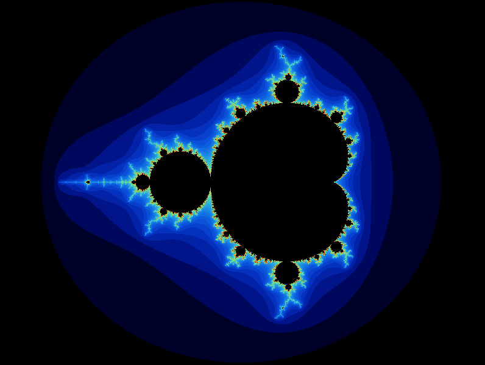
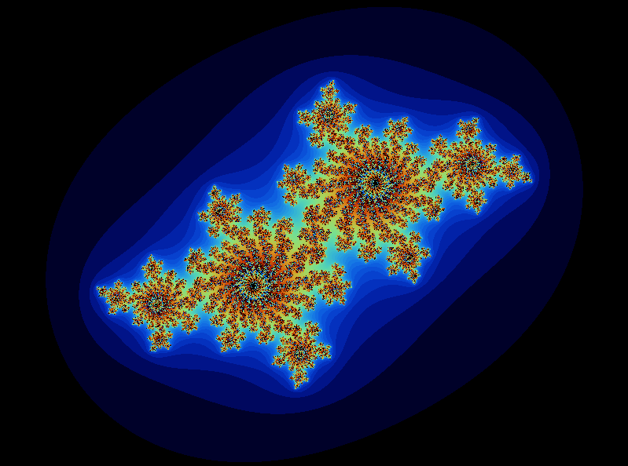
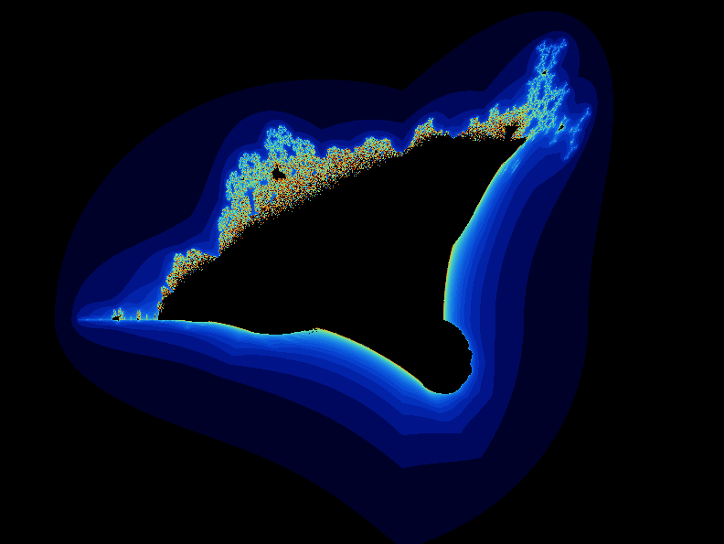

<h1 align=center>
	<b>fract'ol</b>
</h1>

<h4 align=center>
	This project is meant to create graphically beautiful fractals
</h4>

<p align=center>
	In this repo you will find all the codes developed during the <i>fract'ol</i> project, both <b>mandatory</b>'s part and <b>bonus</b>.
</p>

---

<div align=center>
<h2>
	Final score
</h2>

<h4>Completed + Bonus</h4>

</div>

---

<h3 align=center>
Mandatory
</h3>

> <i>This project’s goal is to create a small fractal exploration program. Start by seeing what a fractal is.
The constraints are as follows:
• Your software should offer the Julia set and the Mandelbrot set.
• The mouse wheel zooms in and out, almost infinitely (within the limits of the
computer). This is the very principle of fractals.
• You must use at least a few colors to show the depth of each fractal. It’s even better if you hack away on psychedelic effects.
• A parameter is passed on the command line to define what type of fractal will be viewed. If no parameter is provided, or if the parameter is invalid, the program displays a list of available parameters and exits properly.
• More parameters must be used for fractal parameters or ignored.
• You must be able to create different Julia set with the parameters of the program.
As for the graphic representation:
• ESC will exit the program.
• The use of images of the minilibX is strongly recommended.</i>

<p align=center>

</p>

<h3 align=center>
Bonus
</h3>

> <i>Here are some interesting ideas for the bonuses.
• One more different fractal (there are more than a hundred different types of fractals
referenced online).
• The zoom follows the actual mouse position.
• In addition to the zoom: moving with the arrows.
• Make the color range shift.</i>

---

<h2>
The project
</h2>

### Mandelbrot set



### Julia set -0.428 -0.580i



### Burning-ship set




---
<h2>
Usage
</h2>

### Requirements

`libft` requires *clang* compiler and some standard libraries.

### Instructions

Clone this repository in your local computer:

```sh
git clone https://github.com/edmarpaulino/fractol.git
```

In your local repository, run `make`

```sh
make 
```

> `make` suports 6 flags: 
> - `make all` or simply `make` compiles the project
> - `make bonus` compiles the bonus (in this case only call the flag `all`)
> - `make clean` deletes the `.o` files generated during compilation
> - `make fclean` deletes the `.o` and the `libft.a` executable file
> - `make re` executes `fclean` and `all` in sequence
> - `make rebonus` executes `fclean` and `bonus` in sequence

To run the program correctly, please read the help:

[`help`](messages/help.txt)
